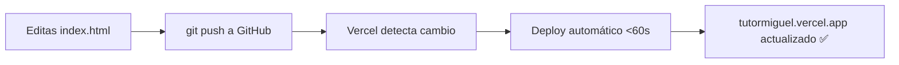

# 🚀 Guía: Publicar TutorMiguel en Vercel (Gratis)

Vercel permite publicar tu página estática (HTML puro) en minutos y de forma **totalmente gratuita**.

---

## Paso 0 — Preparar tu archivo

Tu página es un único archivo `tutorMIGUEL.html`. Para que Vercel lo sirva como página principal, necesitas renombrarlo o agregar un archivo de configuración.

> [!IMPORTANT]
> Vercel busca **`index.html`** como página de inicio. Renombra tu archivo:
> - De: `tutorMIGUEL.html`
> - A: `index.html`

---

## Paso 1 — Subir a GitHub

### 1.1 Crear un repositorio en GitHub

1. Ve a [github.com](https://github.com) y crea una cuenta si no tienes.
2. Clic en **New repository**.
3. Nombre: `tutormiguel` (o el que quieras).
4. Visibilidad: **Public** (para el plan gratis de Vercel).
5. **No** marques "Add a README" (lo harás tú).
6. Clic en **Create repository**.

### 1.2 Subir tu archivo desde Windows

Abre PowerShell o Git Bash en la carpeta del proyecto:

```powershell
# Navega a la carpeta del proyecto
cd "C:\Users\josem\OneDrive\Documentos\UNI\UNI-PERSONAL\proyectos enero\TUTORMIGUEL"

# Inicializar Git (solo la primera vez)
git init
git add index.html
git commit -m "Primer deploy: landing page TutorMiguel"

# Conectar con GitHub (reemplaza TU_USUARIO con tu usuario de GitHub)
git remote add origin https://github.com/TU_USUARIO/tutormiguel.git
git push -u origin main
```

> [!TIP]
> Si no tienes Git instalado: descárgalo en [git-scm.com](https://git-scm.com/download/win)

---

## Paso 2 — Crear cuenta en Vercel

1. Ve a [vercel.com](https://vercel.com).
2. Clic en **Sign Up** → elige **Continue with GitHub**.
3. Autoriza la conexión entre Vercel y tu GitHub.

---

## Paso 3 — Importar el proyecto

1. En el dashboard de Vercel, clic en **Add New → Project**.
2. En la lista de repositorios de GitHub, selecciona **tutormiguel**.
3. Clic en **Import**.

### Configuración del proyecto:

| Campo | Valor |
|---|---|
| Framework Preset | **Other** (es HTML estático) |
| Root Directory | `.` (raíz, déjalo como está) |
| Build Command | *(dejar vacío)* |
| Output Directory | *(dejar vacío)* |

4. Clic en **Deploy**.

✅ En menos de 1 minuto tu página estará en línea en una URL como:
`https://tutormiguel.vercel.app`

---

## Paso 4 — Dominio personalizado (Opcional)

Si quieres un dominio propio como `tutormiguel.com` o `tutormiguel.bo`:

1. En Vercel → tu proyecto → **Settings → Domains**.
2. Escribe tu dominio y clic en **Add**.
3. Vercel te dará registros DNS para configurar en tu proveedor de dominio.

> [!NOTE]
> Dominios `.com` cuestan ~$10-12 USD/año en [Namecheap](https://namecheap.com) o [Porkbun](https://porkbun.com).
> Dominios `.bo` requieren trámite en [NIC Bolivia](https://www.nic.bo).

---

## Paso 5 — Actualizaciones automáticas

Cada vez que actualices tu archivo y hagas push a GitHub, Vercel **redespliega automáticamente** en segundos.

```powershell
# Flujo para futuras actualizaciones
git add index.html
git commit -m "Actualizo precios / agrego sección"
git push
# Vercel detecta el cambio y despliega solo ✅
```

---

## Resumen del flujo completo



---

## Alternativa sin GitHub — Drag & Drop

Si no quieres usar Git:

1. Ve a [vercel.com/new](https://vercel.com/new).
2. Arrastra y suelta la carpeta del proyecto.
3. Vercel la publica de una sola vez.

> [!WARNING]
> Con drag & drop **no tendrás actualizaciones automáticas**. Tendrás que subir manualmente cada vez.
